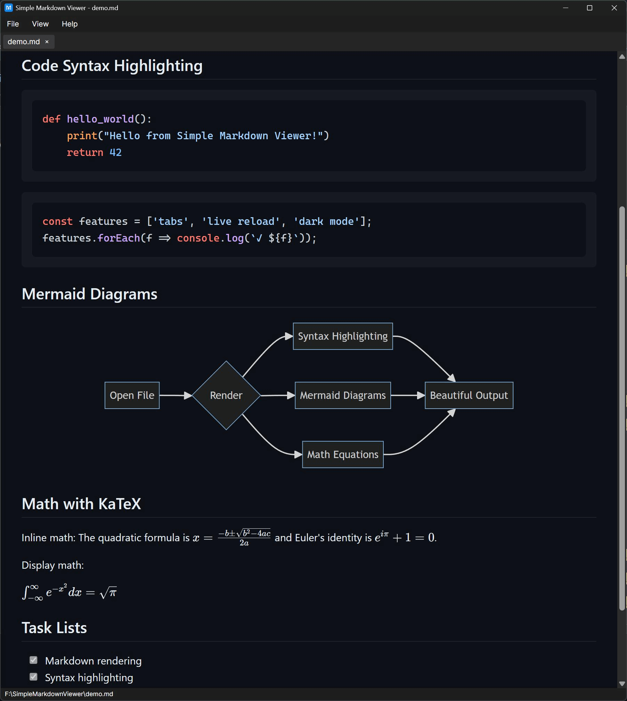

# Simple Markdown Viewer

A lightweight, fast markdown viewer built with Avalonia UI.



## Download

**Windows:** Grab the latest installer from [Releases](https://github.com/KrunchMuffin/SimpleMarkdownViewer/releases).

**Mac/Linux:** Build from source (see below).

## Features

- **Live Reload** - Automatically refreshes when the file changes
- **Tabs** - Open multiple markdown files at once
- **Dark/Light Mode** - Toggle with persisted preference
- **Syntax Highlighting** - Code blocks with highlight.js
- **Mermaid Diagrams** - Flowcharts, sequence diagrams, etc.
- **KaTeX Math** - LaTeX math rendering
- **Drag & Drop** - Drop markdown files onto the window
- **Clipboard Paste** - Create a preview from clipboard content (Ctrl+Shift+V)
- **Recent Files** - Quick access to recently opened files
- **Print/PDF** - Print or save as PDF via system dialog
- **File Association** - Register as default .md viewer (Windows)

## Keyboard Shortcuts

| Shortcut | Action |
|----------|--------|
| Ctrl+O (Cmd+O on Mac) | Open file |
| Ctrl+Shift+V | New from clipboard |
| Ctrl+W | Close tab |
| Ctrl+Shift+C | Copy markdown to clipboard |
| Ctrl+P | Print |
| F5 | Refresh |
| F12 | Dev tools |

## Building from Source

### Prerequisites

- [.NET 8.0 SDK](https://dotnet.microsoft.com/download/dotnet/8.0)

### Clone and Build

```bash
git clone https://github.com/KrunchMuffin/SimpleMarkdownViewer.git
cd SimpleMarkdownViewer
dotnet build
dotnet run
```

### Publish

#### Windows
```bash
dotnet publish -c Release -r win-x64 --self-contained -o publish
```

#### macOS (Intel)
```bash
dotnet publish -c Release -r osx-x64 --self-contained -o publish
```

#### macOS (Apple Silicon)
```bash
dotnet publish -c Release -r osx-arm64 --self-contained -o publish
```

#### Linux
```bash
dotnet publish -c Release -r linux-x64 --self-contained -o publish
```

### Platform Notes

- **Windows:** WebView2 runtime required (pre-installed on Windows 10/11)
- **macOS:** Uses WKWebView (built into macOS)
- **Linux:** Requires WebKitGTK. Install with:
  - Ubuntu/Debian: `sudo apt install libwebkit2gtk-4.1`
  - Fedora: `sudo dnf install webkit2gtk4.1`
  - Arch: `sudo pacman -S webkit2gtk-4.1`

> **Note:** Mac and Linux builds are untested. If you encounter issues, please open an issue on GitHub.

## Windows Installer

To build the Windows installer yourself:

1. Install [Inno Setup 6](https://jrsoftware.org/isdl.php)
2. Run `build-installer.bat`
3. Installer will be in the `installer` folder

## File Association (Windows)

To register as the default handler for `.md` files:

1. Run `register-file-association.reg` as administrator
2. Right-click any `.md` file → Open with → Choose another app → Select SimpleMarkdownViewer

To unregister, run `unregister-file-association.reg`.

## Tech Stack

- [Avalonia UI](https://avaloniaui.net/) - Cross-platform .NET UI framework
- [WebView.Avalonia](https://github.com/AvaloniaCommunity/WebView.Avalonia) - Cross-platform web view
- [Markdig](https://github.com/xoofx/markdig) - Markdown parser
- [highlight.js](https://highlightjs.org/) - Syntax highlighting
- [Mermaid](https://mermaid.js.org/) - Diagrams
- [KaTeX](https://katex.org/) - Math rendering

## License

MIT License - see [LICENSE](LICENSE) file.
