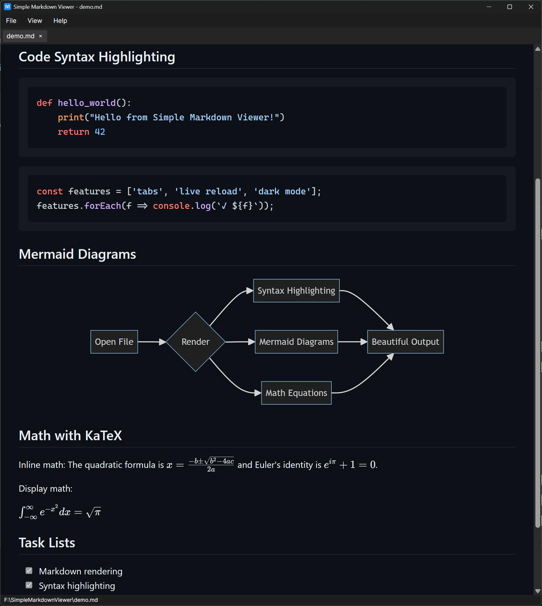

# Simple Markdown Viewer

[](https://github.com/KrunchMuffin/SimpleMarkdownViewer/actions/workflows/build.yml)
[](https://github.com/KrunchMuffin/SimpleMarkdownViewer/releases/latest)
[](LICENSE)

A lightweight, fast markdown and Mermaid viewer and editor built with Avalonia UI.



## Download

**Windows:** Grab the latest installer from [Releases](https://github.com/KrunchMuffin/SimpleMarkdownViewer/releases). The app lets you know when a newer version is available (see [Update Checks](#update-checks)).

**Mac/Linux:** Build from source (see below).

## Features

- **Live Reload** - The preview updates in place when the file changes on disk, keeping your scroll position
- **Tabs** - Open multiple markdown and Mermaid files at once
- **Edit Mode** - Split view with a syntax-highlighted editor and live preview (Ctrl+E), plus a Format menu on right-click (bold, italic, links, headings, lists, code blocks, and more)
- **New, Save, Save As** - Create documents from scratch and save them; you're prompted before closing unsaved changes
- **Dark/Light Mode** - Toggle with persisted preference
- **Custom CSS** - Restyle the preview for each theme (see [Custom CSS](#custom-css))
- **Syntax Highlighting** - Code blocks with highlight.js
- **Mermaid Diagrams** - Flowcharts, sequence diagrams, and standalone `.mmd` / `.mermaid` files; click a diagram to view it full screen with zoom and pan
- **KaTeX Math** - Inline `$...$` and display `$$...$$` LaTeX math
- **Preview Line Numbers** - Show source line numbers beside the preview (View menu)
- **Links** - Web links open in your browser, links to other markdown files open in a new tab, and relative images load from the document's folder
- **Drag & Drop** - Drop markdown or Mermaid files onto the window
- **Clipboard Paste** - Open clipboard text as a new untitled document (Ctrl+Shift+V)
- **Recent Files** - Quick access to recently opened files
- **Print/PDF** - Print or save as PDF via the system print dialog
- **File Association** - The Windows installer can register the app for markdown and Mermaid files
- **Safe Preview** - Scripts embedded in a markdown file never run, so opening files from anywhere is safe; ordinary HTML such as `<details>` or `` still renders

Supported file types: `.md`, `.markdown`, `.mdown`, `.mkd`, `.mkdn`, `.mdwn`, `.mdtxt`, `.mdtext`, `.mdx`, `.rmd`, `.mmd`, `.mermaid`

## Keyboard Shortcuts

Shortcuts use Ctrl on every platform.

| Shortcut | Action |
|----------|--------|
| Ctrl+N | New document |
| Ctrl+O | Open file |
| Ctrl+S | Save (in edit mode) |
| Ctrl+Shift+S | Save as (in edit mode) |
| Ctrl+E | Toggle edit mode |
| Ctrl+B / Ctrl+I / Ctrl+K | Bold / italic / link (in edit mode) |
| Ctrl+W | Close tab |
| Ctrl+Shift+V | New from clipboard |
| Ctrl+Shift+C | Copy markdown to clipboard |
| Ctrl+P | Print |
| F5 | Refresh (also reapplies custom CSS) |
| F12 | Dev tools |
| Esc | Close full-screen diagram |

## Custom CSS

Choose **View > Open Custom CSS** to create and open `custom-dark.css` or `custom-light.css` (for the current theme), pre-filled with the built-in styles. Edit and save it, then press F5 to apply. Delete the file to go back to the defaults.

These files live in the settings folder along with `settings.json`:

- **Windows:** `%LocalAppData%\SimpleMarkdownViewer`
- **macOS:** `~/Library/Application Support/SimpleMarkdownViewer`
- **Linux:** `~/.local/share/SimpleMarkdownViewer`

## Update Checks

At most once a day, when the app starts, it asks GitHub for the latest release version. If there's a newer one, a notice appears at the top of the window with a Download button (which opens the release page) and a Dismiss button. Nothing is downloaded or installed automatically, and no information about you or your files is sent.

You can check manually with **Help > Check for Updates**, or turn automatic checks off with **Help > Check for Updates Automatically**.

## Building from Source

### Prerequisites

- [.NET 10.0 SDK](https://dotnet.microsoft.com/download/dotnet/10.0)

### Clone and Build

```bash
git clone https://github.com/KrunchMuffin/SimpleMarkdownViewer.git
cd SimpleMarkdownViewer
dotnet build
dotnet run
```

### Publish

#### Windows
```bash
dotnet publish -c Release -r win-x64 --self-contained -o publish
```

#### macOS (Intel)
```bash
dotnet publish -c Release -r osx-x64 --self-contained -o publish
```

#### macOS (Apple Silicon)
```bash
dotnet publish -c Release -r osx-arm64 --self-contained -o publish
```

#### Linux
```bash
dotnet publish -c Release -r linux-x64 --self-contained -o publish
```

### Platform Notes

- **Windows:** WebView2 runtime required (pre-installed on Windows 10/11)
- **macOS:** Uses WKWebView (built into macOS)
- **Linux:** Requires WebKitGTK. Install with:
  - Ubuntu/Debian: `sudo apt install libwebkit2gtk-4.1-0`
  - Fedora: `sudo dnf install webkit2gtk4.1`
  - Arch: `sudo pacman -S webkit2gtk-4.1`

> **Note:** Mac and Linux builds are untested. If you encounter issues, please open an issue on GitHub.

## Windows Installer

To build the Windows installer yourself:

1. Install [Inno Setup 6](https://jrsoftware.org/isdl.php)
2. Run `build-installer.bat` from a Command Prompt
3. The installer will be in the `installer` folder

## File Association (Windows)

The installer offers checkboxes to make Simple Markdown Viewer the default app for:

- Common extensions: `.md`, `.markdown`
- Extended extensions: `.mdown`, `.mkd`, `.mkdn`, `.mdwn`, `.mdtxt`, `.mdtext`
- Specialized extensions: `.mdx`, `.rmd`
- Mermaid extensions: `.mmd`, `.mermaid`

For each group you tick, the app becomes the default and is added to **Open with** for those file types. To change the default later, right-click a file → **Open with** → **Choose another app**. Uninstalling removes the associations.

## Tech Stack

- [Avalonia UI](https://avaloniaui.net/) - Cross-platform .NET UI framework
- [Avalonia WebView](https://github.com/AvaloniaUI/Avalonia.Controls.WebView) - Native web view (WebView2 / WKWebView / WebKitGTK)
- [AvaloniaEdit](https://github.com/AvaloniaUI/AvaloniaEdit) - Text editor with TextMate syntax highlighting
- [Markdig](https://github.com/xoofx/markdig) - Markdown parser
- [highlight.js](https://highlightjs.org/) - Syntax highlighting
- [Mermaid](https://mermaid.js.org/) - Diagrams
- [KaTeX](https://katex.org/) - Math rendering

## Contributing

Bug reports, ideas, and pull requests are welcome. See [CONTRIBUTING.md](CONTRIBUTING.md) to get started, and please follow the [Code of Conduct](CODE_OF_CONDUCT.md).

## Security

Please report security problems privately, as described in [SECURITY.md](SECURITY.md).

## License

MIT License, © 2026 DAB Worx Inc. See the [LICENSE](LICENSE) file.
