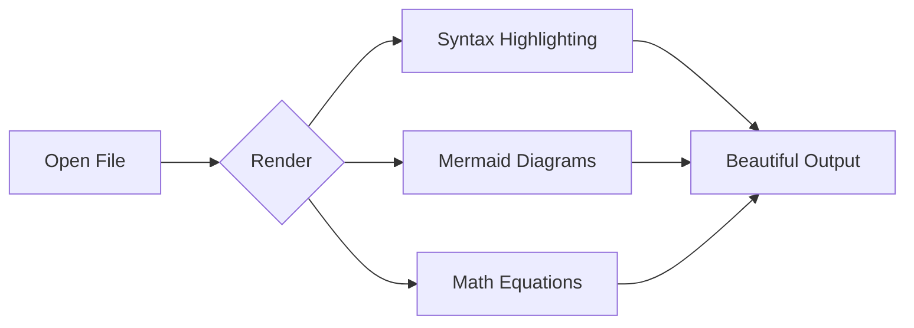

# Simple Markdown Viewer

A lightweight markdown viewer with **live reload**, tabs, and dark mode.

## Features at a Glance

- 📁 Open multiple files in **tabs**
- 🔄 **Live reload** when files change
- 🌙 Dark/Light mode toggle
- 📋 Paste markdown from clipboard

## Code Syntax Highlighting

```python
def hello_world():
    print("Hello from Simple Markdown Viewer!")
    return 42
```

```javascript
const features = ['tabs', 'live reload', 'dark mode'];
features.forEach(f => console.log(`✓ ${f}`));
```

## Mermaid Diagrams



## Math with KaTeX

Inline math: The quadratic formula is $x = \frac{-b \pm \sqrt{b^2 - 4ac}}{2a}$ and Euler's identity is $e^{i\pi} + 1 = 0$.

Display math:

$\int_{-\infty}^{\infty} e^{-x^2} dx = \sqrt{\pi}$

## Task Lists

- [x] Markdown rendering
- [x] Syntax highlighting  
- [x] Mermaid diagrams
- [x] Dark mode
- [x] Live reload

> **Tip:** Press `Ctrl+Shift+V` to preview markdown from your clipboard!
