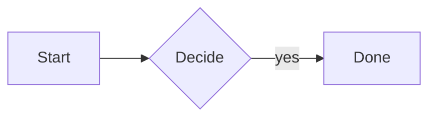

# Smoke test


```mermaid
flowchart LR
    A[Start] --> B{Decide}
    B -->|yes| C[Done]
```

Inline math $e^{i\pi} + 1 = 0$ and a display formula:

$$\int_{-\infty}^{\infty} e^{-x^2} dx = \sqrt{\pi}$$

```python
def hello_world():
    return 42
```
